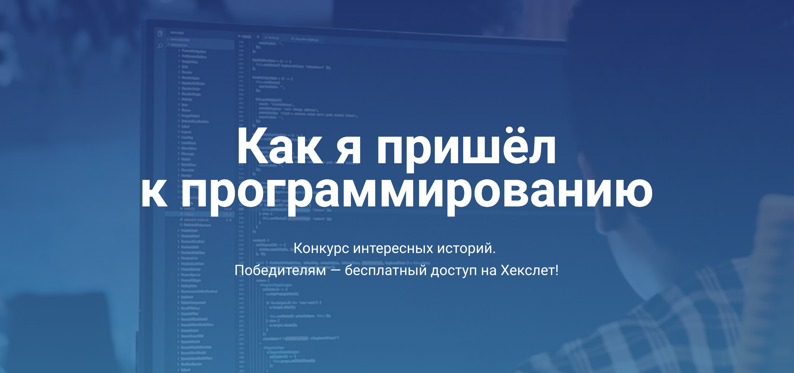

# Как я пришёл к программированию

Вы ищете работу? Возможно, свою первую работу программистом? Напишите интересную историю о том, как и почему вы стали изучать программирование, как выглядит ваш процесс обучения и роста. Авторы трёх историй, набравших больше всего «старов» (звёздочек) на Гитхабе, получат призы! [Перейти на красочную промо-страницу конкурса →](http://mystory.hexlet.io/)

## Истории
(последнее обновление 18.10.2018, 10:50)
1. [Моя Санта-Барбара](https://github.com/solncebro/our-stories/blob/master/stories/AaronWinnov.md)
2. [Обучение программированию после 50-ти](https://github.com/AnatolMeshalkin/our-stories/blob/master/stories/AnatolMeshalkin.md)
3. [Почему работа программиста более привлекательна чем работа специалиста по информационной безопасности (субъективно)](https://github.com/kitXIII/our-stories/blob/master/stories/KitStory.md)
4. [Кем я себя не видел через 5 лет](https://github.com/MacOSO/our-stories/blob/master/stories/MacOSO.md)
5. [Программируем-с](https://github.com/REGISTOOOOOO/our-stories/blob/master/stories/REGISTOOOOOO.md)
6. [The shaping of the question is part of the answer](https://github.com/Searge/our-stories/blob/master/stories/Searge.md)
7. [Вторая попытка](https://github.com/kamil861120/our-stories/blob/master/stories/SecondChance.md)
8. [Компьютерная империя наносит ответный удар!](https://github.com/vitaclear/our-stories/blob/master/stories/Vita.md)
9. [C’est la vie](https://github.com/XenaN/our-stories/blob/master/stories/Xena.md)
10. ["Чтобы добиться многого, необходимы две вещи:план и недостаток времени". Леонард Бернстайн.](https://github.com/jurassic-period/our-stories/blob/master/stories/fromSifm.md)
11. [Ленивый питон](https://github.com/s4lat/our-stories/blob/master/stories/lazyPython.md)
12. [Всем привет, я - гуманитарий](https://github.com/GlowBlood/our-stories/blob/master/stories/little_story.md)
13. [Путь длинною в 30 лет или...](https://github.com/ivcoderx/our-stories/blob/master/stories/long-road.md)
14. [Как из-за ошибки в одной букве я не стал программистом. Моя подробная история :)](https://github.com/eidolonzx/our-stories/blob/master/stories/my_wild_story_MS.md)
15. [Никогда не поздно, или труд побеждает талант](https://github.com/Mrtopuh/our-stories/blob/master/stories/never_too_late.md)
16. [Endorphins](https://github.com/MaxiMir/our-stories/blob/master/stories/MaxiMir.md)
17. [Если бы не одно но...Мне 47](https://github.com/svil1502/our-stories/blob/master/stories/svil.md)
18. [От таблетки к биту](https://github.com/TyrionFront/our-stories/blob/master/stories/Ruslan.md)
19. [Где-то 7 лет назад!](https://github.com/ZoomieOS/our-stories/blob/master/stories/zoomieos.md)
20. [Приход в программирование из вёрстки](https://github.com/k2miha/our-stories/blob/master/stories/MihailKolotovich.md)
21. [Тысяча внезапных озарений](https://github.com/karasino/our-stories/blob/master/stories/wanna%20be%20a%20rockstar.md)
22. [Как я нашёл себя в Java](https://github.com/YolgaDev/our-stories/blob/master/stories/TerziAl.md)
23. [Write less, do more](https://github.com/SmAlVad/our-stories/blob/master/stories/meine-geschichte.md)
24. [Мамы разные нужны, мамы разные важны!](https://github.com/Zelenina33/our-stories/blob/master/stories/Zelenina33.md)
25. [Дорогу осилит идущий!](https://github.com/maximoto83/our-stories/blob/master/stories/myroad.md)
26. [Быть или-не быть](https://github.com/natawik/our-stories/blob/master/stories/tobe-or-not.md)
27. [Меня обманула "Пина Колада", теперь моя жизнь - tabula rasa.](https://github.com/arti911/our-stories/blob/master/stories/myHistor.md)
28. [История возвращения на Hexlet](https://github.com/JuliaStrelkova/our-stories/blob/my-story/stories/My_story_of_return_to_Hexlet.md)
29. [Из научного сотрудника во frontend-разработчика](https://github.com/kotevidze/our-stories/blob/master/stories/from_scientist_to_js_developer.md)
30. [ШОК, ученые открыли...](https://github.com/oksanaduga/our-stories/blob/master/stories/oksanaduga.md)
31. [Как не потерять 10 лет своей жизни](https://github.com/daryalaktionova/our-stories/blob/patch-1/stories/laktionova.md)
32. [Через тернии](https://github.com/pavel-else/our-stories/blob/master/stories/pavel-else.md)
33. [Важно не только желание но и хорошая поддержка](https://github.com/shmel115/our-stories/blob/master/stories/good_support.md)
34. [Как стать программистом, когда тебе за 30 у тебя есть жена, ребенок и ипотека](https://github.com/demshin/our-stories/blob/master/stories/demshin.md)
35. [Как оно в 35 снова за парту](https://github.com/Bodrus/our-stories/blob/master/stories/Bodrus.Maxim.md)

## Призы

1 место — год обучения на Хекслете + 2 проекта.  
2 место — год обучения на Хекслете + 1 проект.  
3 место — год обучения на Хекслете.

Утешительные призы: с 4 по 6 места — по месяцу обучения на Хекслете.

## Инструкции для голосующих

1. Выберите понравившиеся истории.
2. В каждой из выбранных историй перейдите по ссылке на форк участника.
3. В форке участника истории поставьте звёздочку в правом верхнем углу.

## Инструкции

1. Сделайте форк этого репозитория.
2. В своём форке создайте новый `.md`-файл в директории `stories`. Напишите туда свою историю, следуя шаблону `TEMPLATE.md`.
3. Обязательно добавьте в конец файла ссылку на свой форк (см. пример в шаблоне).
4. Сделайте Pull Request.
5. (опционально) Сделайте твит со ссылкой на свою историю. Сделайте mention аккаунта Хекслета `@HexletHQ`. Мы сделаем ретвит.

## Как увеличить шансы на победу
- Сделайте твит (см. предыдущий абзац)
- Скиньте ссылку в другие социальные сети
- Расскажите о своей истории в нашем чате http://slack-ru.hexlet.io
- Позвоните друзьям :)

**Победители будут определены 1 ноября 2018.**

## Правила
1. К конкурсу не допускаются работающие фуллтайм программисты. Если вы еще никогда не работали программистом или находитесь в поиске работы, то конкурс как раз для вас!
1. Один участник — одна история.
1. Минимум 2000 символов в тексте истории (не считая заголовка)
1. Искуственная «накрутка» приводит к дисквалификации.
1. Конкурс стартует 24 сентября 2018 года.
1. Победители будут определены 1 ноября 2018.
